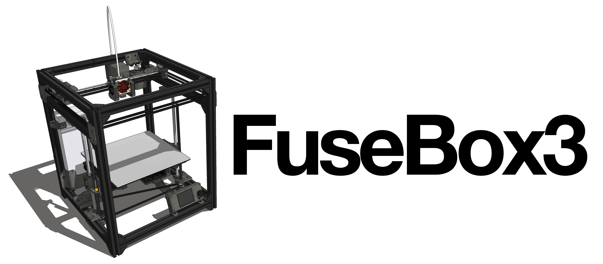

:warning: **Still under active development**: Parts and documentation may change!

The latest in the FuseBox line of 3D printers.

## Specs
- 235x235x235mm build area
- 348x370x426mm frame dimensions
- 2020 extrusion frame
- E3D v6 type hotend with Bowden extruder
- CoreXY movement system running on MGN9/MGN12 rail

## Improvements over FuseBox2/R:
- Y-axis rods swapped out for MGN9 rails fixed directly to the frame
- Space efficiency - slightly smaller desk footprint - 348x370mm vs 390x340mm
- More stable dual leadscrew z-axis, belt driven by a single motor (avoids leadscrews getting out of sync)
- Dual 4010 blowers, mounted on either side of the hotend for better cooling performance
- More precise belt tensioning via sliding motor mounts

## [BOM](documentation/BOM.md)