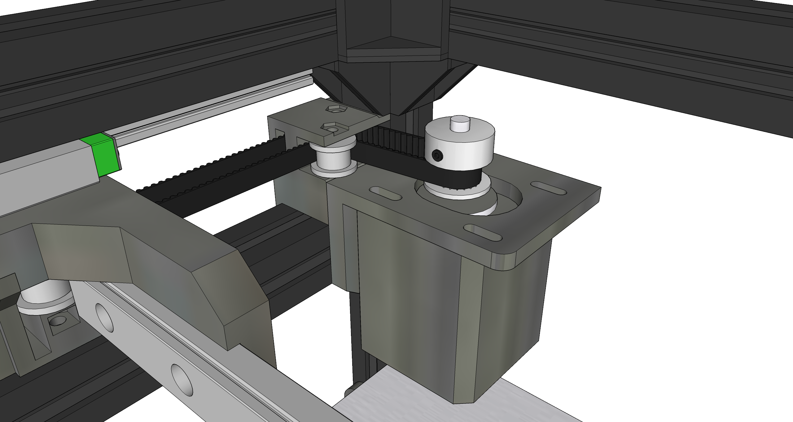

:warning: **Still under active development**: Parts and documentation may change!

## The latest in the FuseBox line of 3D printers.

FuseBox3 is a midsize CoreXY printer designed for fast printing and high output quality.

Specs:
- Build area: 235x235x235mm
- Frame dimensions: 348x370x426m
- CoreXY movement system running on MGN9/MGN12 rail
- 2020 extrusion frame
- E3D v6 type hotend with Bowden extruder
- Dual leadscrew, belt-driven z-axis
- Dual 4010 blower print cooling + 4010 axial fan hotend cooling

## Quick Links
### [BOM](documentation/BOM.md)
### [Version history](documentation/versions.md)

# Design and changes from FuseBox2/R
While the original FuseBox and FuseBox2 were optimized for simplicity and low build cost, FuseBox3 targets a more premium price point without being overly expensive. However, accessibility and ease of construction is still a priority. Therefore, the printer needs no custom CNC'd parts, and all parts were picked to be easily sourceable online.

### Linear rails
With clone linear rails becoming cheaper and more easily available, the CoreXY movement has been redesigned to ride completely on linear rails - the y-axis now uses MGN9 rails screwed directly to the extrusions, which improves rigidity compared to the old linear rods. From experience on the FuseBox2R, the rails should have the added benefit of lower noise. Like the 2R, the gantry/x-axis uses a single MGN12 rail, although 50mm longer to account for the additional build area.

### Belt path changes, tensioning improvements
The FuseBox and FuseBox2/R share a similar belt path - the motors are mounted in the corners of the frame, and the motor pulleys serve as the "ends" of the belt path on the back side. This belt path design minimizes the number of idler pulleys needed, at the cost of quite a bit of wasted space in the x direction, necessitating a wider frame.

On the FuseBox3, two additional idlers have been added on the rear (motor) side to bring the belts as close to the sides of the frame as possible. This allows the FuseBox3's frame to be 42mm shorter in the x direction than the FuseBox2R's, while simultaneously having an additional 25mm of x-axis travel. The motors have been relocated to the very back of the machine, just underneath the top rear horizontal extrusion. The motor mounts now have slotted screw holes, allowing the motors to slide for adjusting belt tension. On the FuseBox and FuseBox2/R, tensioning was done by manually pulling on the belts and sliding them into carriage-mounted belt clamps. The new tensioning system should significantly simplify the belt mounting and tensioning process.

Additionally, the front idler brackets have been changed so that the top and bottom idlers are stacked on top of each other rather than offset. This makes the idlers easier to assemble and saves a bolt and nut on each side.

[Idler comparison pic]

### Z-axis
The z-axis keeps the 8mm rods due to space and cost constraints, but is now reconfigured as a dual leadscrew setup. On the prototype FuseBox2, the cantilevered z-axis was slightly susceptible to vibration and would also occasionally bind due to the cheap LM8LUU bearings used. The new design's rods have been relocated to the sides of the printer, and each side gets a leadscrew. To prevent the leadscrews from getting out of sync, they are belted together and driven by a single motor. The new z-axis should have improved stability and be less susceptible to binding.

### Hotend carriage, print cooling
The general arrangement of FuseBox3's carriage is very similar to the carriage on the older FuseBox2R, with the main differences being the print cooling setup and the belt mounting method. Subjectively, it's also a lot tidier in appearance than the earlier carriage designs.

Since the FuseBox3 has sliding motor mounts, tensioning is no longer done on the carriage. The belts are now attached to the carriage by a pair of clamp pieces that screw into the main carriage body. The clamps have a small cutout on the inner side for routing excess belt, so the belts don't have to be shaved to a precise length like they do on the FuseBox2R.

[Pic of the new carriage belt clamps]

The print cooling setup swaps out the single 4020 blower for twin 4010 blowers flanking the hotend. The old single blower design provided relatively good cooling performance, but the airflow only came from one side, leading to weaker cooling for certain overhang orientations. The new twin fan arrangement has more even part cooling coverage, and the very short ducts provide less airflow restriction.

[Pics comparing cooling ducts]

Todo: bold some important parts in the design section